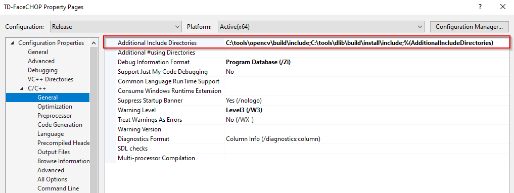
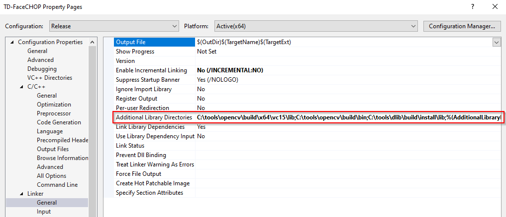
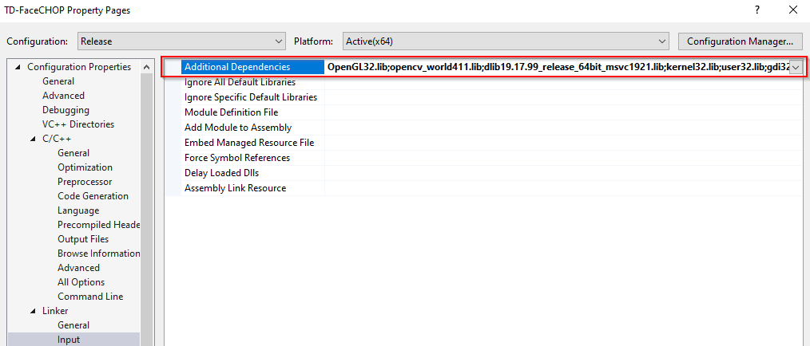

[//]: # (For development of this README.md, use http://markdownlivepreview.com/)

# TD-FaceCHOP
##### Face landmark detection with openCV and dlib (in TouchDesigner).

FaceCHOP takes an image and an expected camera horizontal field-of-view. The output is 4 channels and many samples. Each detected face corresponds to 71 samples. The first face involves samples 0-70; the second is 71-141; then 142-212 and so on. Of the 71 samples, the first 68 samples are the 2D (tx/ty) locations of the face landmarks. These correspond to the indices of the [iBUG 300-W dataset](https://ibug.doc.ic.ac.uk/resources/facial-point-annotations/).

After these 68 samples, the next sample is a rectangular box indicating where the face is. Basically, it's (center x, center y, size x, size y). Check the example TouchDesigner project for more context.
The next sample is the translation of the face (tx, ty, tz). The fourth channel here is unused.
The next sample is the rotation of the face (rx, ry, rz). The fourth channel here is unused.

FaceCHOP has a toggle for using face landmark detection, so if you only care about getting the rectangular box of a face, leave it unchecked. Note that if you use face landmark detection, which is a step in finding the pose (rotation & translation) of a face, then you need to follow the licensing of iBUG. iBUG does not allow commercial use, so contact them for more information.

There's a useful parameter "Facerectframeskip" whose label is "Face Rectangle Frame Skip." Processing the rectangles of faces is far more time-consuming that placing the landmarks on the faces. If you want to get some speed savings and can sacrifice a little accuracy of the landmarks, it can be a good idea to skip 1, maybe 2 frames. If the value is 0, then you'll calculate new face rectangles for every frame.

# Installation

If you can't build the project yourself, visit the "Releases" page on Github. I've compiled a `TD-FaceCHOP.dll` for Windows TD.2019.19160. Wherever you use `TD-FaceCHOP.dll`, `opencv_world411.dll` must be its direct neighbor.

## openCV
Download [openCV](https://opencv.org/releases/). I use 4.1.1 but you can probably use other versions.
On Windows, I've placed the opencv folder at C:/tools/opencv so that I have `C:\tools\opencv\build\x64\vc15\lib\opencv_world411.lib`. Next place `opencv_world411.dll` in `TD-FaceCHOP\Plugins`. Wherever you use `TD-FaceCHOP.dll`, `opencv_world411.dll` must be its direct neighbor.

## dlib

Clone [dlib](https://github.com/davisking/dlib) to `C:\tools\dlib`. These are my three steps for building on Windows.

    mkdir build; cd build;
    cmake -g "Visual Studio 16 2019 Win64" -T host=x64 -DCMAKE_INSTALL_PREFIX=install .. -DUSE_AVX_INSTRUCTIONS=1;
    cmake --build . --config Release --target INSTALL

You should end up with `C:\tools\dlib\build\install\lib\dlib19.17.99_release_64bit_msvc1921.lib`

Now download dlib's [`shape_predictor_68_face_landmarks.dat`](http://dlib.net/files/shape_predictor_68_face_landmarks.dat.bz2) and place it in the root of TD-FaceCHOP. It's also available [here](https://github.com/davisking/dlib-models). By using this file you must obey the licensing of the iBUG dataseet.

## Visual Studio Properties
If you install opencv or dlib with other methods or in other locations, you'll need to modify the properties of the Visual Studio solution. For my build setup, 
note how both the opencv and dlib directories have been added to "Additional Include Directories"

Note how both the opencv and dlib directories have been added to "Additional Library Directories"

Note how both the opencv and dlib lib files have been added to "Additional Dependencies"

## To do
* Avoid using openCV entirely.
* Try other methods
 * [https://github.com/1adrianb/face-alignment](https://github.com/1adrianb/face-alignment)
 * [https://github.com/yinguobing/head-pose-estimation](https://github.com/yinguobing/head-pose-estimation)

## Thanks
* [http://dlib.net/webcam\_face\_pose\_ex.cpp.html](http://dlib.net/webcam\_face\_pose\_ex.cpp.html)
* [https://www.learnopencv.com/head-pose-estimation-using-opencv-and-dlib/](https://www.learnopencv.com/head-pose-estimation-using-opencv-and-dlib/)
* [http://aifi.isr.uc.pt/HeadPoseEstimation.html](http://aifi.isr.uc.pt/HeadPoseEstimation.html)
* [https://github.com/lincolnhard/head-pose-estimation](https://github.com/lincolnhard/head-pose-estimation)
* [https://github.com/mourendxu/TD-OpenCV3TOP](https://github.com/mourendxu/TD-OpenCV3TOP)

# Dependent licenses
[iBUG 300-W dataset](https://ibug.doc.ic.ac.uk/resources/facial-point-annotations/) does not offer commercial usage. This dataset was used to make `shape_predictor_68_face_landmarks.dat`, which is what makes it possible to identify the 68 landmarks on a face. The bounding-box part of this project is not restricted by iBUG's license, but the landmark detection is.

FaceCHOP also uses numbers from [http://aifi.isr.uc.pt/HeadPoseEstimation.html](http://aifi.isr.uc.pt/HeadPoseEstimation.html) that represent an expected 3D head shape in centimeters. That project is copyright of [Pedro Martins](pedromartins@isr.uc.pt) but licensed under GNU General Public License.
